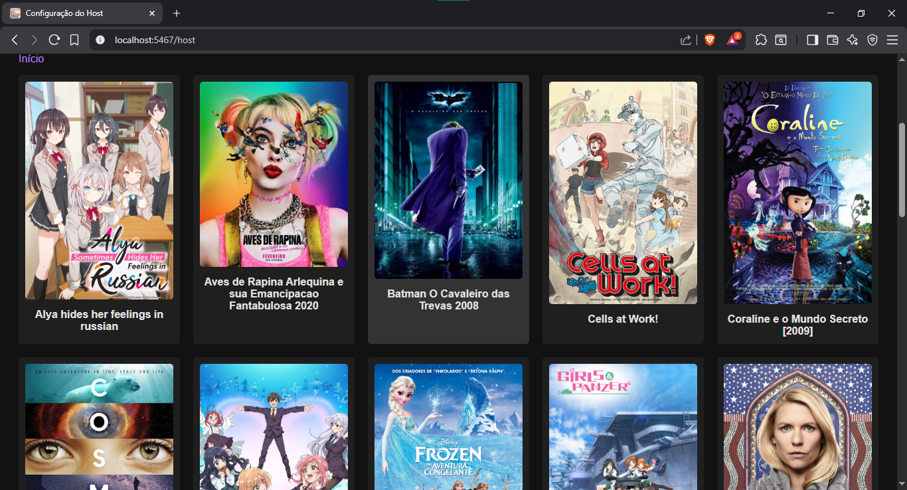
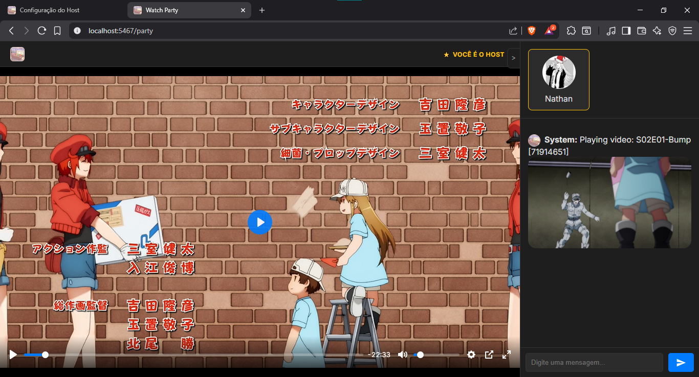
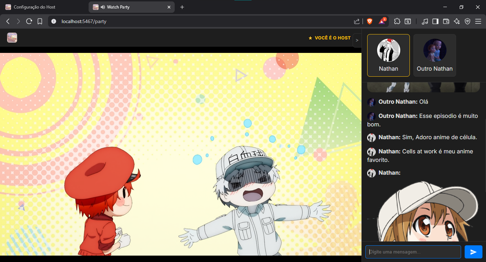

# Watch Party v1

Aplicação em Python para assistir vídeos localmente com amigos.

## preview:



---

## Como Usar (Host)

1.  **Instalar dependências:**
    ```bash
    pip install -r requirements.txt
    ```
2.  **Configurar:**
    * Abra o arquivo `save.json` na raiz do projeto.
    * Adicione o caminho para sua pasta de vídeos:
        ```json
        {
            "port": 5467,
            "video_dir": "/caminho/para/seus/videos",
            "auto_scrape": false
        }
        ```
3.  **Iniciar o Servidor:**
    ```bash
    python src/main.py
    ```
4.  **Abrir o Painel do Host:**
    * Abra `http://127.0.0.1:8000/host` no seu navegador.
5.  **Configurar a Sala:**
    * Copie o "Link de Convite" (que usará seu IP público IPv6/IPv4) e envie para seus amigos.
    * Selecione o vídeo que deseja assistir e clique em "Carregar Vídeo".
6.  **Entrar na Sala:**
    * Clique no link para "entrar na página da sala" (ou use o link de convite).
    * Você será o host e seus controles (play, pause, seek) irão sincronizar todos os outros.

## Como Usar (Cliente)

1.  Receba o link de convite do host (ex: `http://[IPv6_DO_HOST]:8000/`).
2.  Abra o link no seu navegador.
3.  Defina seu nome de usuário.
4.  Aguarde o host iniciar o vídeo.