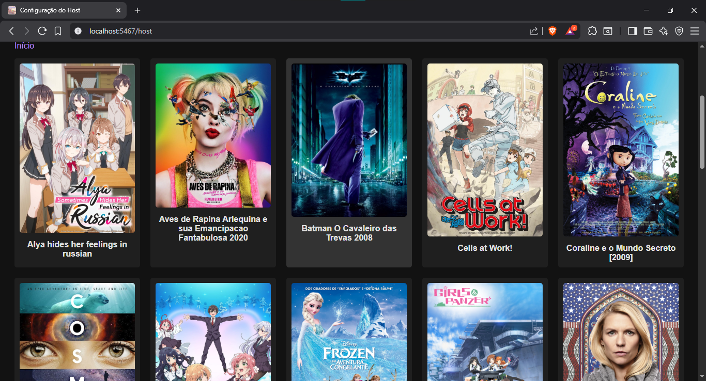
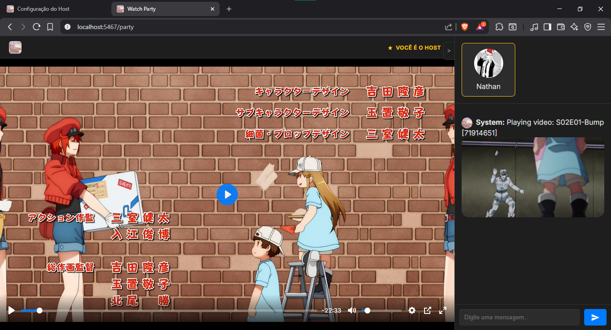
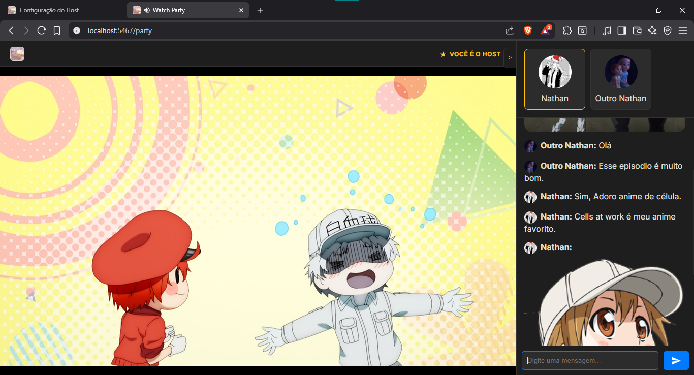

# Watch Party v1

Aplicação em Python para assistir vídeos localmente com amigos.

## preview:



---

## Como Usar (Host)

1.  **Instalar dependências:**
    ```bash
    pip install -r requirements.txt
    ```
2.  **Configurar:**
    * Abra o arquivo `save.json` na raiz do projeto.
    * Adicione o caminho para sua pasta de vídeos:
        ```json
        {
            "port": 5467,
            "video_dir": "/caminho/para/seus/videos",
            "auto_scrape": false,
            "ice_servers": [
                { "urls": "stun:stun.l.google.com:19302" },
                { "urls": "turn:turn.exemplo.com:3478", "username": "usuario", "credential": "senha" }
            ]
        }
        ```
        * O servidor TURN é opcional, mas ajuda a transmissão de tela a funcionar pela internet quando STUN sozinho não atravessa a rede/NAT.
3.  **Iniciar o Servidor:**
    ```bash
    python src/main.py
    ```
4.  **Abrir o Painel do Host:**
    * Abra `http://127.0.0.1:8000/host` no seu navegador.
5.  **Configurar a Sala:**
    * Copie o "Link de Convite" (que usará seu IP público IPv6/IPv4) e envie para seus amigos.
    * Selecione o vídeo que deseja assistir e clique em "Carregar Vídeo".
6.  **Entrar na Sala:**
    * Clique no link para "entrar na página da sala" (ou use o link de convite).
    * Você será o host e seus controles (play, pause, seek) irão sincronizar todos os outros.

## Como Usar (Cliente)

1.  Receba o link de convite do host (ex: `http://[IPv6_DO_HOST]:8000/`).
2.  Abra o link no seu navegador.
3.  Defina seu nome de usuário.
4.  Aguarde o host iniciar o vídeo.

## Docker e servidor TURN

1. Copie `.env.example` para `.env` e configure `WATCHPARTY_VIDEO_DIR`, `TURN_HOST` e um `TURN_SECRET` aleatório longo.
2. Inicie a aplicação e o Coturn:
   ```bash
   docker compose up -d --build
   ```
3. Encaminhe no roteador e permita no firewall as portas `3478` UDP/TCP e `49160-49200` UDP, ou os valores definidos no `.env`.
4. Abra `http://localhost:5467/host` e escolha **Sem TURN**, **Automático** ou **Forçar TURN**.

O modo selecionado vale para novas conexões de tela e microfone e volta para **Automático** quando o servidor reinicia. Em conexões residenciais com CGNAT, o encaminhamento de portas não funciona; nesse caso, hospede o Coturn em uma VPS ou solicite um IP público. Se `TURN_HOST` usar um registro da Cloudflare, mantenha esse registro como DNS direto, sem proxy.
